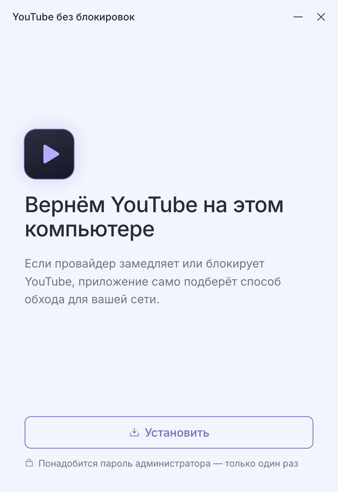
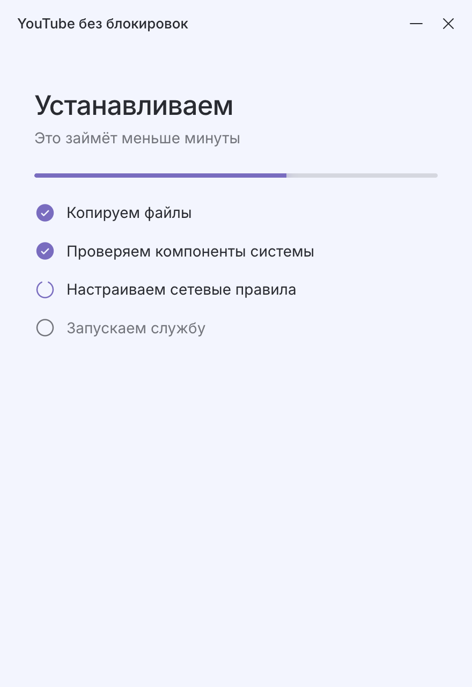
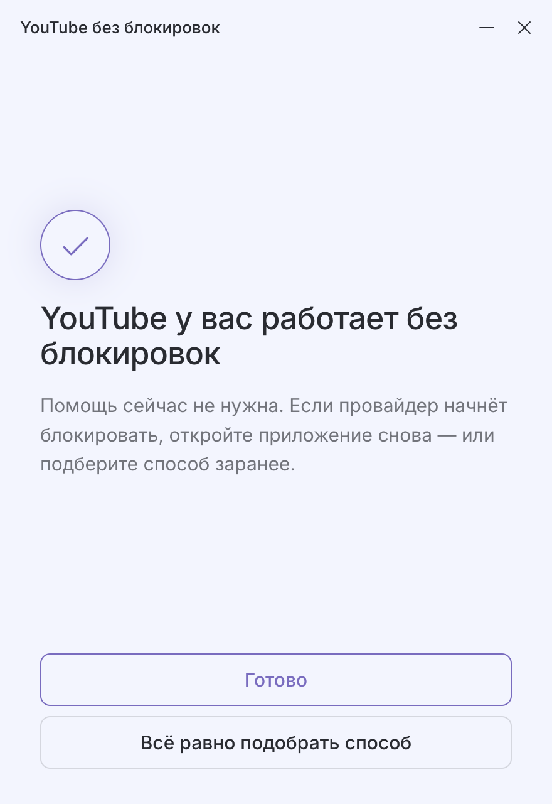
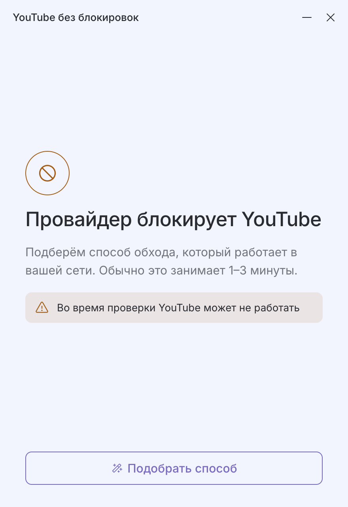
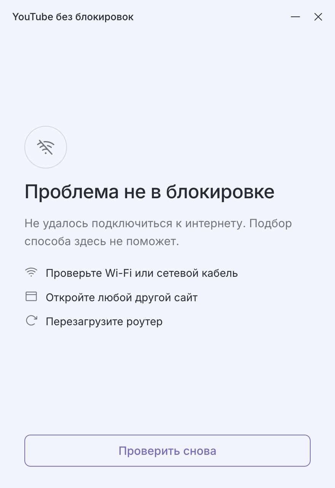
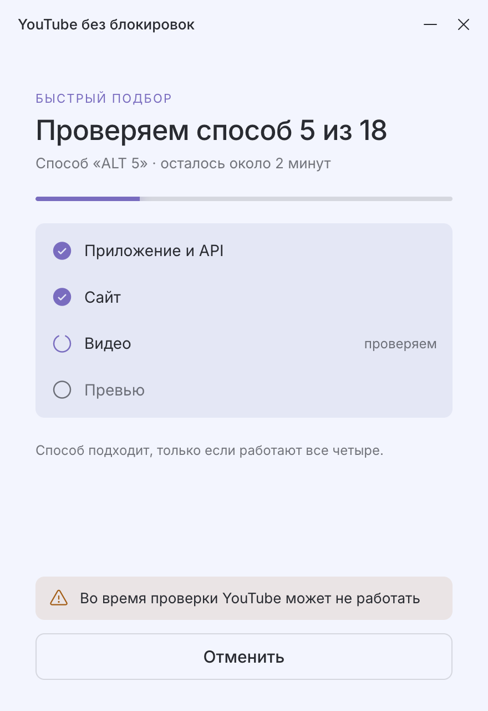
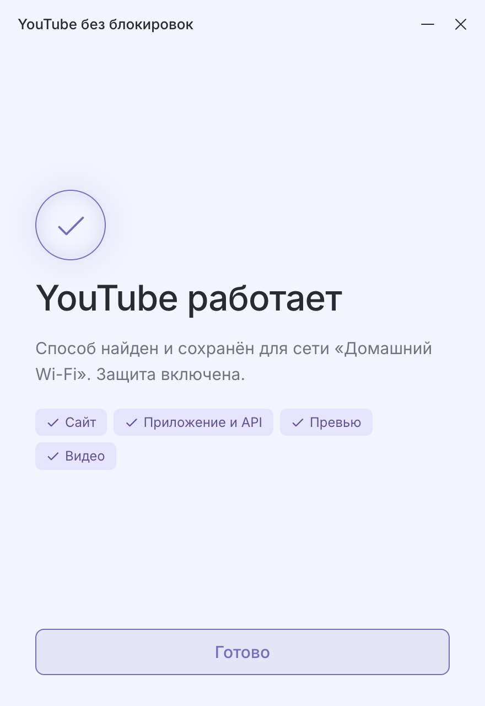
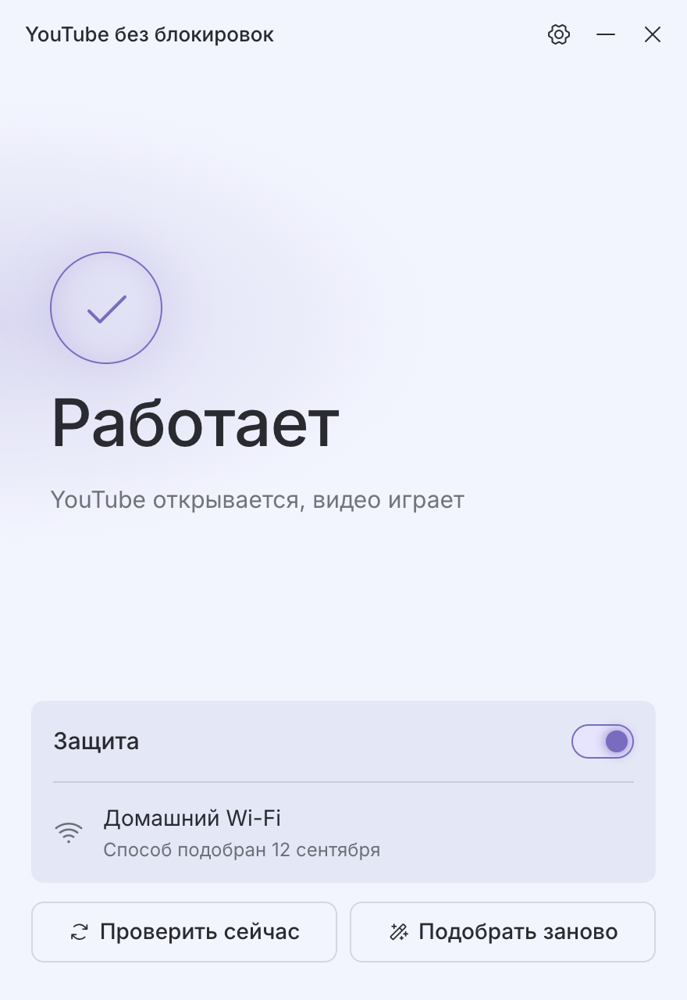
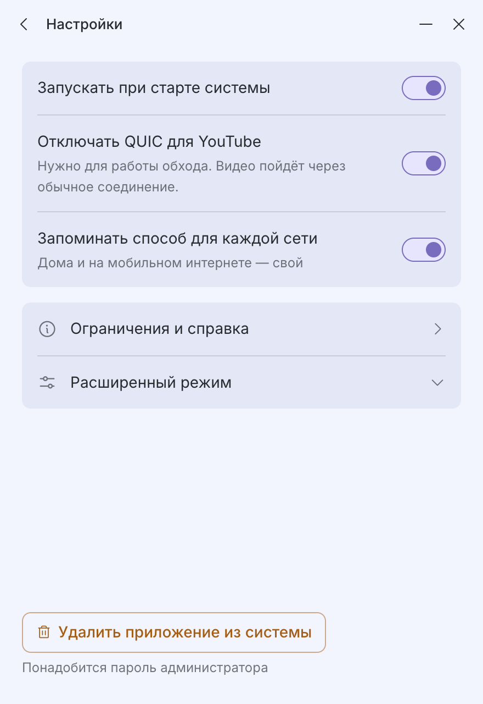

# YouTube без блокировок

Приложение для Linux, которое возвращает нормальную работу YouTube, если провайдер его
блокирует или замедляет. Само подбирает способ обхода — ничего настраивать вручную не нужно.

> Это неофициальное приложение. Оно не связано с Google/YouTube и не связано с автором
> zapret. В его основе лежит открытый инструмент
> [zapret2 (bol-van/zapret2)](https://github.com/bol-van/zapret2), часть готовых стратегий
> обхода взята из [zapret-discord-youtube (flowseal)](https://github.com/flowseal/zapret-discord-youtube).
> Логотип и фирменные цвета YouTube не используются.

## Скачать

Сначала определитесь с версией:

- **Обычный компьютер или ноутбук (x86_64 / Intel, AMD)** — подходит почти всем.
- **ARM (aarch64)** — например, Raspberry Pi 5 или ноутбук на процессоре ARM.

Если не уверены — выбирайте первый вариант, он подходит подавляющему большинству компьютеров.
Проверить точно можно командой в терминале: `uname -m` — если она выведет `x86_64`, нужен
первый файл, если `aarch64` или `arm64` — второй.

Ссылки всегда ведут на последнюю версию:

- [Скачать для обычного компьютера (x86_64)](https://github.com/bakuridzeaslan025-max/zapret-youtube-gui/releases/latest/download/ytunblock-x86_64.AppImage)
- [Скачать для ARM (aarch64)](https://github.com/bakuridzeaslan025-max/zapret-youtube-gui/releases/latest/download/ytunblock-aarch64.AppImage)
- [Все версии и что изменилось](https://github.com/bakuridzeaslan025-max/zapret-youtube-gui/releases)

## Как пользоваться

### 1. Разрешить запуск файла

Linux по умолчанию не даёт запускать скачанные файлы как программы — это защита системы, не
имеет отношения к нашему приложению. Разрешить можно один раз:

- **Мышкой:** правой кнопкой по скачанному файлу → «Свойства» → вкладка «Права» (или
  «Permissions») → поставить галочку «Разрешить выполнение файла как программы»
  (Allow executing file as program).
- **Командой в терминале** (для тех, кто умеет):
  ```
  chmod +x ytunblock-x86_64.AppImage
  ```

### 2. Запустить

Дважды кликните по файлу. Откроется окно приветствия. Если на Ubuntu 23.10+/24.04 окно не
появляется — см. [«Не запускается на Ubuntu 24.04»](#не-запускается-на-ubuntu-2404).

<p>
<picture>
  <source media="(prefers-color-scheme: dark)" srcset="docs/screenshots/1a-welcome-dark.png">
  
</picture>
</p>

### 3. Установить

Нажмите «Установить». Система спросит пароль администратора — он нужен один раз, чтобы
приложение могло встроиться в систему и включать/выключать обход блокировки. Дальше пароль
спрашиваться не будет.

<p>
<picture>
  <source media="(prefers-color-scheme: dark)" srcset="docs/screenshots/1c-installing-dark.png">
  
</picture>
</p>

### 4. Проверка сети

Приложение проверит, действительно ли YouTube заблокирован. Три варианта результата:

<p>
<picture>
  <source media="(prefers-color-scheme: dark)" srcset="docs/screenshots/2b-unblocked-dark.png">
  
</picture>
</p>

- **«YouTube у вас работает без блокировок»** — помощь не нужна, можно всё равно включить
  приложение на будущее.

<p>
<picture>
  <source media="(prefers-color-scheme: dark)" srcset="docs/screenshots/2c-dpi-dark.png">
  
</picture>
</p>

- **«Провайдер блокирует YouTube»** — приложение предложит подобрать способ обхода.

<p>
<picture>
  <source media="(prefers-color-scheme: dark)" srcset="docs/screenshots/2d-path-dark.png">
  
</picture>
</p>

- **«Проблема не в блокировке»** — интернета нет или сервер недоступен по другой причине,
  подбор способа тут не поможет; приложение подскажет, что проверить.

### 5. Подбор способа обхода

Сначала — быстрый подбор (обычно 1–3 минуты): приложение перебирает готовые способы.

<p>
<picture>
  <source media="(prefers-color-scheme: dark)" srcset="docs/screenshots/3a-quick-dark.png">
  
</picture>
</p>

Если быстрый подбор не помог, можно запустить долгий (от десятков минут до нескольких часов).
Окно можно закрыть — подбор продолжится в фоне. Если в системе есть трей, приложение останется
там и пришлёт уведомление, когда подбор закончится.

### 6. Готово

Когда способ найден, YouTube снова работает.

<p>
<picture>
  <source media="(prefers-color-scheme: dark)" srcset="docs/screenshots/3b-found-dark.png">
  
</picture>
</p>

<p>
<picture>
  <source media="(prefers-color-scheme: dark)" srcset="docs/screenshots/5a-on-dark.png">
  
</picture>
</p>

Главный экран показывает текущий статус и позволяет включать/выключать обход, проверять сеть
заново и открывать настройки.

<p>
<picture>
  <source media="(prefers-color-scheme: dark)" srcset="docs/screenshots/6a-settings-dark.png">
  
</picture>
</p>

## Частые вопросы

**Нужно ли держать приложение открытым?**
Нет. Оно работает в фоне (в том числе после перезагрузки компьютера), само включается вместе
с системой. Окно можно закрыть: если в системе есть трей, значок останется там; если трея нет
(например, GNOME без расширения AppIndicator) — окно просто закроется, а обход продолжит
работать.

**Как выключить или удалить приложение?**
В настройках есть кнопка «Удалить приложение из системы» — она полностью уберёт всё, что было
установлено (снова попросит пароль администратора).

**Сменил сеть или провайдера — что делать?**
Приложение само замечает новую сеть и предложит подобрать способ обхода заново — для каждой
сети (дома, на работе, в другом месте) способ может быть свой.

**Видео всё равно тормозит или заикается — что делать?**
Нажмите «Проверить сейчас» на главном экране. Если способ перестал работать (провайдер мог
изменить блокировку), запустите подбор заново. Если и это не помогает — возможно, дело не в
блокировке, а в обычной перегрузке сети.

**Работает ли на телевизоре или телефоне?**
Нет, приложение работает только на этом компьютере — оно не защищает другие устройства в сети.

**На каких системах работает?**
На большинстве современных дистрибутивов Linux с systemd: Ubuntu, Fedora, Linux Mint, Manjaro
и похожих. Специально проверено на Manjaro GNOME.

<a name="не-запускается-на-ubuntu-2404"></a>
**Не запускается на Ubuntu 24.04 (или 23.10+)?**
В этих версиях Ubuntu AppArmor по умолчанию запрещает программам создавать изолированные
«песочницы» (`kernel.apparmor_restrict_unprivileged_userns=1`), а Electron-приложения в формате
AppImage без них могут не запуститься вовсе. Разрешение для нашего приложения ставится при
установке, но до установки окно может не открыться. Мы ещё не проверили это на живой Ubuntu 24.04,
поэтому это подсказка на случай проблемы, а не обязательный шаг. Для первого запуска выберите
**один** из вариантов:

- запустить из терминала без песочницы, только чтобы нажать «Установить», потом закрыть и
  дальше запускать как обычно:
  ```
  ./ytunblock-x86_64.AppImage --no-sandbox
  ```
- или временно снять ограничение (действует до перезагрузки), установить приложение и вернуть
  как было:
  ```
  sudo sysctl -w kernel.apparmor_restrict_unprivileged_userns=0
  # запустить приложение, нажать «Установить»
  sudo sysctl -w kernel.apparmor_restrict_unprivileged_userns=1
  ```

Оба варианта на время ослабляют защиту, поэтому не оставляйте их включёнными насовсем. Разрешение,
которое ставит установка, привязано к имени файла: если переименуете AppImage, переустановите
приложение.

**Это безопасно?**
Исходный код приложения открыт и доступен в этом репозитории. Всё, что устанавливается в
систему, можно посмотреть в папке [`system/`](system/). Установка делает следующее и больше
ничего:

- кладёт программу и файлы zapret2 в `/opt/ytunblock`, состояние — в `/var/lib/ytunblock`,
  журналы — в `/var/log/ytunblock`;
- создаёт systemd-службу `ytunblock` и правила `nft` (таблица `inet ytunblock`), пока служба
  включена;
- добавляет модули ядра `nfnetlink_queue`/`nft_queue` в автозагрузку
  (`/etc/modules-load.d/ytunblock.conf`);
- ставит polkit-политику (`/usr/share/polkit-1/actions/org.ytunblock.helper.policy`), чтобы
  не спрашивать пароль при каждом включении;
- на Ubuntu 23.10+ — AppArmor-профиль `/etc/apparmor.d/ytunblock-appimage` (разрешение
  песочницы для AppImage);
- если в системе нет `nftables` или `curl` — ставит эти пакеты через штатный менеджер пакетов.

Кнопка «Удалить приложение из системы» убирает всё это, кроме доставленных пакетов `nftables`/`curl`.

<details>
<summary>Для технически подкованных</summary>

### Как устроено

- Движок обхода — [zapret2](https://github.com/bol-van/zapret2) (`nfqws2` + `blockcheck2`).
  Правила `nft` отдают в `nfqws2` только первые пакеты соединений на порт 443 (TCP и UDP/QUIC),
  менять `nfqws2` разрешено только соединения к доменам YouTube из hostlist. Исключение —
  стратегии, срабатывающие ещё до того, как известно имя сайта (например, `syndata`, ALT5):
  они действуют на все TCP-соединения к порту 443.
- GUI — Electron, распространяется как AppImage. AppImage запускается непривилегированным
  пользователем; всё, что требует root (установка в `/opt`, systemd-юнит, правила `nft`,
  polkit-правило), выполняется через `pkexec`-хелпер, разово копируемый на диск при установке
  (root не может читать FUSE-маунт AppImage).
- Автоподбор в два этапа: быстрый — перебор готовых стратегий (переведены из
  [flowseal/zapret-discord-youtube](https://github.com/flowseal/zapret-discord-youtube),
  MIT); долгий — штатный `blockcheck2` с ограничением по времени/охвату.
- Подробнее об архитектуре и принятых решениях — [`CLAUDE.md`](CLAUDE.md) и
  [`docs/decisions.md`](docs/decisions.md).

### Где что лежит

- [`app/`](app/) — Electron-приложение (main/preload/IPC + renderer).
- [`system/`](system/) — всё, что ставится от root: `install.sh`/`uninstall.sh`, хелпер,
  systemd-юнит, правила `nft`, polkit, статический `nfqws2` и файлы zapret2.
- [`strategies/`](strategies/) — список стратегий обхода и hostlist.
- [`docs/`](docs/) — исследования, решения, контракты, чек-листы ручного тестирования.

### Сборка из исходников

```sh
cd app
npm ci
npm run dist   # electron-builder --linux AppImage --x64 --arm64
```

Перед сборкой `predist` подтягивает бинарники zapret2 через `system/fetch-zapret2.sh`.

### Тесты

Уровни тестов, где они лежат и как запускаются — [`docs/testing.md`](docs/testing.md).

### Лицензия

Код приложения — MIT, см. [`LICENSE`](LICENSE). В поставку включены сторонние компоненты со
своими MIT-лицензиями: [zapret2](system/licenses/zapret2-LICENSE.txt) и
[стратегии flowseal](system/licenses/flowseal-LICENSE.txt).

</details>
